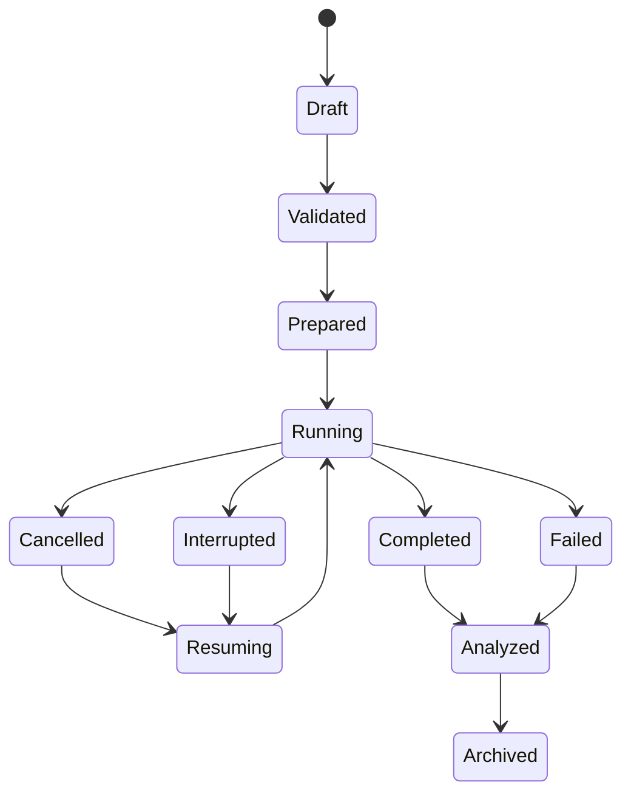

# Research architecture

## 1. Goal and scope

Build one auditable local research system that can host multiple mathematical models without coupling their physics to the UI, plotting library, or storage layout. The initial scientific target is the three-dimensional charged recurrence experiment in `first-experiment.md`; later experiments must reuse the same lifecycle and artifact contracts.

This document specifies boundaries. It does not implement a new physical solver or claim a scientific result.

## 2. Architectural principles

- **One runner, multiple adapters.** CLI, local service, and tests call the same runtime.
- **Physics is a plugin, not a screen.** React displays validated contracts and saved outputs; it never reimplements equations.
- **Runs are immutable evidence.** Resume creates a new attempt linked to the same run; reanalysis creates a new analysis linked to immutable raw data.
- **Preparation is explicit.** Validation, resource estimation, domain construction, initial data, and solver selection are inspectable stages.
- **Failure is data.** Invalid, rejected, cancelled, interrupted, numerically failed, scientifically failed, and unresolved are distinct states.
- **Claims are downstream artifacts.** A report statement links to analysis, checks, data, configuration, and code provenance.
- **Historical separation.** The existing delay-network packages remain available but do not define new-model equations or contracts.

## 3. Implemented E00 workspace

```text
contracts/research/
  experiment.schema.json
  run-manifest.schema.json
  event.schema.json
  artifact.schema.json
python/
  pyproject.toml
  signal_space/
    contracts/       validation and generated boundary types
    runtime/         lifecycle, process isolation, events, resume
    models/          actions, equations, state and conserved quantities
    numerics/        meshes, continuation, solvers, eigensystems
    experiments/     protocols and acceptance classifiers
    analysis/        diagnostics, convergence and comparisons
    reporting/       figure specs and Markdown/HTML/PDF rendering
    service/         loopback API and resumable event stream
apps/
  cli/               thin command adapter
  web/               thin local service client and artifact explorer
research/
  experiments/<experiment-id>/<run-id>/
```

Python is the planned numerical runtime because the experiments require sparse eigensolvers, boundary-value solvers, array formats, and scientific plotting. TypeScript owns browser presentation and generated boundary types. JSON Schema is authoritative at the process boundary.

## 4. Plugin contract

Each registered experiment exposes pure metadata plus these stages:

| Stage      | Input                           | Output                                     | May mutate run package? |
| ---------- | ------------------------------- | ------------------------------------------ | ----------------------- |
| `describe` | Experiment ID/version           | Capabilities, equations, units, parameters | No                      |
| `validate` | User configuration              | Closed validated configuration or issues   | No                      |
| `estimate` | Validated configuration         | CPU, memory, disk, wall-time class         | No                      |
| `prepare`  | Configuration and seed ledger   | Domain, initial state, solver plan         | New attempt only        |
| `run`      | Prepared attempt                | Checkpoints, events, raw outputs           | Append only             |
| `analyze`  | Completed/partial outputs       | Derived datasets and checks                | New analysis only       |
| `classify` | Checks and declared criteria    | pass/fail/unresolved with evidence links   | New analysis only       |
| `report`   | Manifest plus selected analysis | Figures and reports                        | New report only         |

Plugins never receive arbitrary browser paths. IDs resolve through a server-side registry and artifact catalog.

## 5. Runtime lifecycle



Lifecycle state and scientific classification are orthogonal. A technically completed run may still be scientifically `failed` or `unresolved`. An interrupted run may have analyzable partial evidence.

Each attempt runs in a bounded subprocess with:

- explicit CPU, memory, output, and wall-time limits;
- cooperative cancellation followed by a declared termination policy;
- append-only numbered events;
- atomic checkpoint and manifest updates;
- separate deterministic seed streams for initialization, perturbations, sampling, and analysis;
- hash checks before resume.

## 6. Configuration identity

The runtime resolves user input into a canonical closed document containing:

- schema and experiment versions;
- action/model ID and equation references;
- parameters with units;
- geometry, mesh, boundaries, initial data, and continuation plan;
- solver algorithms and tolerances;
- seed ledger;
- resource limits;
- analysis and acceptance plan.

The run key hashes the canonical resolved configuration plus relevant code/environment identities. Presentation-only settings are excluded. Changing a physical or numerical input creates a new run; adding a plot creates a new report or analysis.

## 7. Execution surfaces

The E00 CLI exposes:

```text
list  validate  estimate  run  sweep  status  cancel  resume
analyze  compare  report  verify  archive
```

The loopback service exposes equivalent registered operations plus a resumable event stream. It binds to loopback only, uses an ephemeral origin-bound token, validates `Origin`, and rejects arbitrary commands or filesystem paths.

The UI provides:

- experiment selection and schema-driven configuration;
- units, domain restrictions, equation/source links, and resource estimates;
- lifecycle, attempt/event, checkpoint, and failure audit views;
- field slices, tables, time series, spectra, and convergence plots from saved data;
- compatible-run comparison with every material difference visible;
- report regeneration/export and claim-to-evidence navigation;
- the existing searchable research collection.

Unavailable runtime features must be labeled unavailable, never represented by inert controls.

## 8. Reporting and plotting

Figures are generated by the reporting package from saved data and versioned figure specifications. Every plot records source datasets, transformations, units, axes, ranges, normalization, downsampling, fit windows, and rendering versions. Plot data is exported as CSV or JSON beside PNG, SVG, and PDF renderings.

Reports are generated headlessly as Markdown and HTML, with PDF as a checked export. They include assumptions, method, controls, convergence, error budget, failures, limitations, and exact provenance. Regeneration must not execute the physical solver.

## 9. Extension workflow

To add an experiment:

1. assign a stable experiment and model ID;
2. cite the exact action/equations and create a closed schema;
3. implement the plugin stages without UI imports;
4. add analytic controls and inexpensive deterministic fixtures;
5. predeclare acceptance and unresolved criteria;
6. add report/figure specifications;
7. verify CLI/service parity and lifecycle recovery;
8. archive an accepted small fixture before research-scale execution.

## 10. Implementation phases

1. Contracts, deterministic synthetic fixture, immutable package, CLI lifecycle.
2. Analysis/report regeneration, verification, archive command.
3. Loopback service and UI run/audit journey.
4. E01 radial branch, continuation, diagnostics, and spectrum.
5. Distributed/accelerated execution only after local contracts stabilize.
