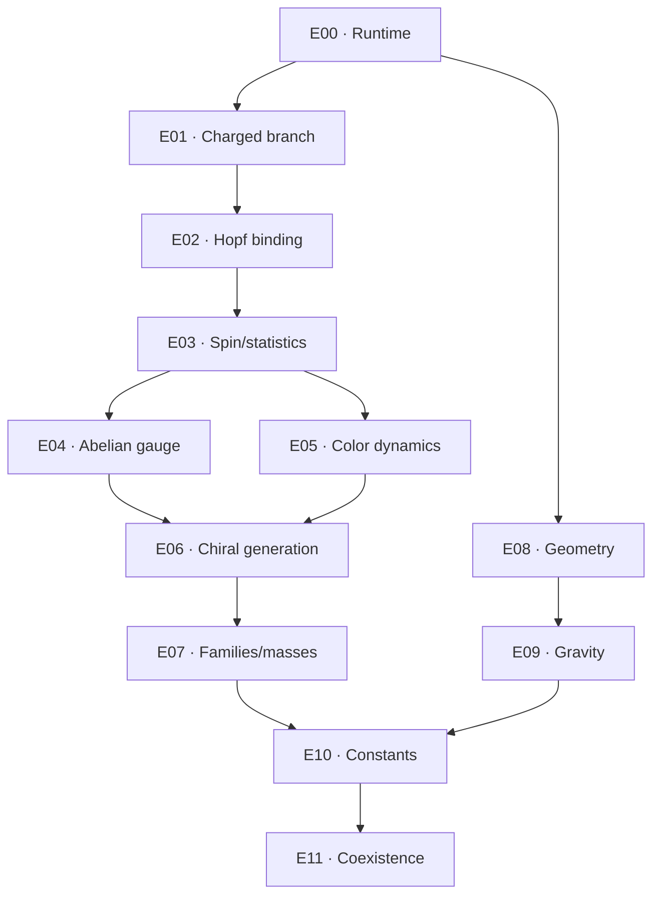

# Experiment execution plan

## 1. Ordering rule

The program advances by derivation gates. Later labels are not imported into earlier models. Every gate may end in pass, fail, or unresolved; a negative result can complete an experiment.

| ID  | Question                                                                             | Primary evidence                                                               | Gate to continue                                             |
| --- | ------------------------------------------------------------------------------------ | ------------------------------------------------------------------------------ | ------------------------------------------------------------ |
| E00 | Does the common runtime preserve identity, lifecycle, resume, analysis, and reports? | Deterministic synthetic fixture and fault injection                            | Artifact and CLI/service parity checks pass                  |
| E01 | Does the prescribed 3D charged action possess a resolved stable branch candidate?    | Radial continuation, constrained spectra, thresholds, convergence              | Candidate or explicit no-candidate/unresolved result         |
| E02 | Can an orientation/Hopf sector bind to the charged reference state?                  | Full 3D minimization/dynamics, topology, perturbations, breakup controls       | Bound localized sector stable within declared tests          |
| E03 | Does configuration-space quantization permit spin-1/2 and fermionic exchange?        | Collective coordinates, topology of configuration space, two-point functions   | Observable spin/statistics result, not a visual `4π` analogy |
| E04 | Does a massless local Abelian gauge sector emerge?                                   | Gauss constraint, transverse propagator, Coulomb response, Ward identities     | Photon-like field and normalized current from one action     |
| E05 | Do coherent internal responses support local non-Abelian color dynamics?             | Derived three-state algebra, link/connection dynamics, confinement diagnostics | Continuous local algebra plus Yang–Mills-type dynamics       |
| E06 | Can one anomaly-free chiral matter generation be obtained?                           | Left/right representations, charged and neutral currents, anomaly ledger       | One complete representation set before mass fitting          |
| E07 | Why three generations, masses, and mixing?                                           | Common mass operator, spectra, CKM/PMNS-type matrices, held-out ratios         | More predictions than calibrations with uncertainty          |
| E08 | Do exchange clocks and all modes recover one 3+1 geometry?                           | Cone, clock, dimension, Lorentz, locality, regulator-flow tests                | Universal calibrated geometry in one regime                  |
| E09 | Does the same effective theory yield gravitational response?                         | Stress response, constraints, propagating modes, weak-field tests              | Universal coupling and controlled corrections                |
| E10 | Are coupling/scale relations predictive?                                             | Common normalization, running, dimensionless ratios                            | Held-out constants after declared calibration subset         |
| E11 | Do all claimed limits coexist?                                                       | Shared parameter region and integrated regression suite                        | No mutually exclusive tuning or hidden model swap            |

## 2. Common protocol for every experiment

### A. Pre-registration

Record the question, action, units, observables, domain, boundaries, solver family, control cases, acceptance thresholds, known failure modes, resource budget, and prohibited inferences. Freeze these before a research-scale scan.

### B. Analytic controls

Derive dimensions, symmetries, currents, identities, limiting cases, vacuum solutions, origin/boundary behavior, and any exact or manufactured solution. These controls are independent of the primary implementation when practical.

### C. Numerical ladder

1. inexpensive smoke fixture;
2. baseline resolved run;
3. independent spacing and volume refinement;
4. algorithm/tolerance refinement;
5. nonsymmetric and adversarial perturbations;
6. alternative observable extraction;
7. held-out parameter points.

Endpoint and failed members stay in the sweep record.

### D. Classification

Technical completion and scientific outcome are separate. Each criterion links to a computed check and error budget. Margins must exceed declared numerical/modeling uncertainty; thresholds are not retuned after observing a preferred outcome.

### E. Reporting

Generate a machine-readable result, branch/sweep tables, controls, convergence plots, spectra or fields as appropriate, limitations, and a human-readable report from saved data.

## 3. Dependency logic

E08 may proceed in parallel with matter-sector work after E00 because it tests the underlying exchange/clock architecture. E10 and E11 cannot use separate actions for each successful sector.

## 4. Near-term execution

1. Implement E00 in issue #37.
2. Extend the collection browser toward the run/audit UI in issue #38.
3. Implement E01 exactly as `first-experiment.md` and issue #39 specify.
4. Review E01 outcome before defining E02 parameters. A failed E01 triggers model review rather than immediate topology additions.

## 5. Stop conditions

Pause a model family when it requires unrelated dynamics for each target, cannot maintain a common propagation cone, violates conservation/positivity, depends on boundary artifacts, loses the claimed object under nonsymmetric refinement, or obtains desired symmetry only by assigning the target group. Document the failure and preserve the run package.
